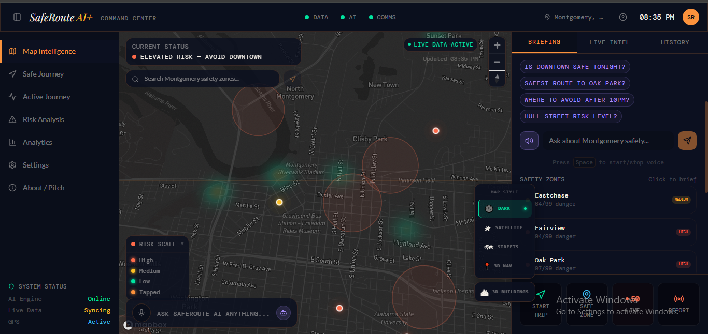
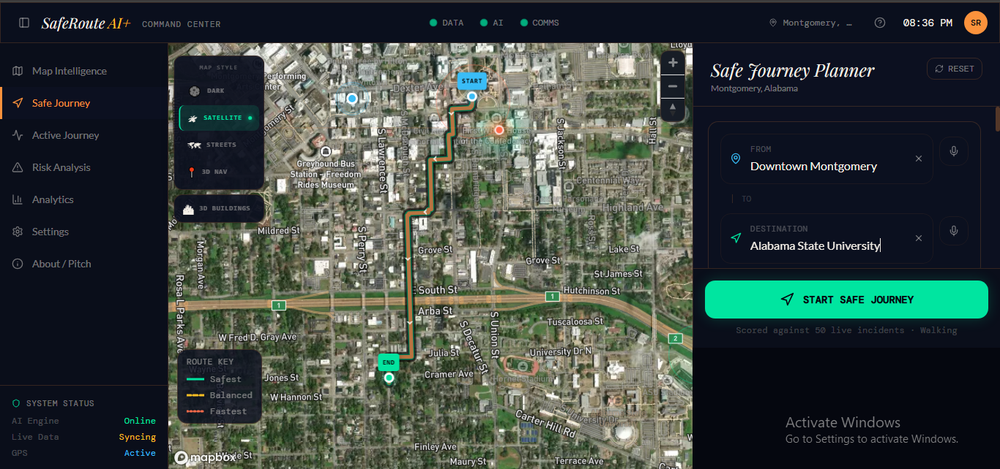
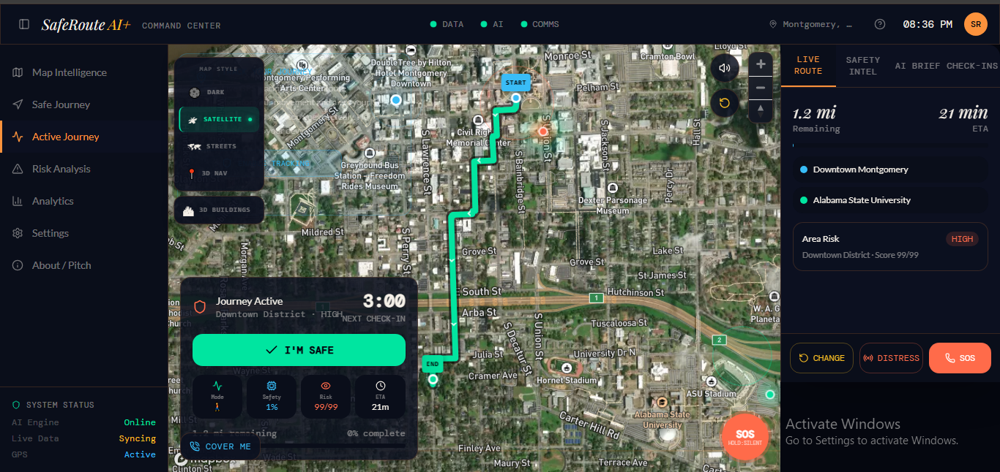

# SafeRoute AI+

<div align="center">


**A real-time AI-powered personal safety navigator for Montgomery, AL.**  
*Route smarter. Stay safer. Never go silent.*

[**🌐 Live Demo**](https://saferoute-ai-one.vercel.app) · [**📽 Demo Video**](#demo) · [**🏆 Hackathon Result**](#hackathon) · [**🛠 Tech Stack**](#tech-stack)

</div>

---

## 🏆 Hackathon Recognition

> **World Wide Vibes Hackathon 2026 — Organised by GenAI.Works**  
> **Category:** Public Safety  
> **Result:** Top 10% of approximately 3,000 global submissions  
> **Built:** Solo, in 4 days, March 5–9, 2026  

The World Wide Vibes Hackathon challenged participants worldwide to build AI-powered solutions to real civic challenges for the City of Montgomery, Alabama. SafeRoute AI+ was entered in the **Public Safety** category and evaluated on relevance, execution quality, originality, social impact, and commercial potential by industry experts and community leaders.

---

## 🎯 What Is SafeRoute AI+?

SafeRoute AI+ is a production-grade personal safety navigator that goes far beyond standard routing apps. It does not just get you from A to B — it monitors your journey in real time, scores every possible route by live crime data, alerts your trusted guardians if something goes wrong, and gives you AI-powered awareness of your surroundings as you move.

**The core problem it solves:** People — especially women, students, and night-time commuters — navigate unfamiliar areas without real-time awareness of safety conditions. Existing apps route for speed, not safety. SafeRoute routes for both, and keeps watching after you leave.

---

## ✨ Features

### 🗺️ Smart Routing Engine
- **Three simultaneous route options** rendered live on a Mapbox map:
  - 🟢 **Safest Route** — minimises exposure to high-incident areas
  - 🟡 **Balanced Route** — optimises between safety and travel time
  - 🔴 **Fastest Route** — standard navigation, with a safety score overlay
- All three routes are drawn precisely on the map with colour-coded polylines
- Each route is scored in real time against live ArcGIS crime incident data

### 🚨 Guardian Safety System
- Set one or more trusted guardian contacts with **email and WhatsApp**
- If an anomaly is detected during your active navigation journey, alerts are automatically dispatched to every guardian simultaneously
- **Dead man's switch** — if you do not check in within a set time window, your guardians are automatically notified with your last known location
- **Silent SOS distress broadcast** — trigger an alert discreetly without opening the app or making a call

### 📍 Live Journey & Navigation Monitoring
- **Journey Page** — set your destination, review all three routes, and choose your path
- **Navigation Page** — active monitoring of your movement in real time using your device's live GPS location
- Anomaly detection runs continuously during navigation — unusual stops, route deviations, or stationary periods trigger the guardian alert pipeline
- All monitoring is non-intrusive and runs in the background

### 🗣️ AI Voice Intelligence
- Click any point on the map to receive an **AI-generated description of that location**
- Descriptions are read aloud via the **Web Speech API** — fully hands-free safety awareness
- Useful for understanding unfamiliar neighbourhoods, landmarks, and risk context before committing to a route

### 📢 Community Incident Reporting
- Any user can **anonymously report a safety incident** at any location
- Reports are instantly reflected as **live markers on the map** for all users
- Creates a community-powered, real-time safety layer on top of the official ArcGIS crime data

### 📱 Fully Responsive
- Works seamlessly on desktop and mobile
- Designed for real-world use — in a pocket, on a bus, walking at night
- Onboarding tutorial modal guides first-time users through every feature

---

## 📽 Demo

> A full narrated demo video walkthrough is available showing every feature in action — routing, guardian setup, anomaly detection, voice readback, incident reporting, and the SOS system.

**Live App:** [saferoute-ai-one.vercel.app](https://saferoute-ai-one.vercel.app)

### Screenshots

<p align="center">
  
  &nbsp;
  
</p>

<p align="center">
  
</p>

---

## 🛠 Tech Stack

| Layer | Technology | Purpose |
|---|---|---|
| **Frontend** | React, JavaScript | Application framework and component architecture |
| **Maps** | Mapbox GL JS | Map rendering, route polylines, live markers |
| **Safety Data** | ArcGIS Crime Incident API | Live crime data powering route safety scores |
| **AI Voice** | Web Speech API | Hands-free AI place description readback |
| **Guardian Alerts** | Twilio (WhatsApp API) | Real-time WhatsApp distress messages to guardians |
| **Email Alerts** | Email Integration | Backup guardian notification channel |
| **Location** | Browser Geolocation API | Live GPS tracking during active navigation |
| **Deployment** | Vercel | Production hosting with global CDN |
| **Data Scraping** | Bright Data | Supplementary city data integration |

---

## 🏗️ Architecture

```
User Device
    │
    ├── Mapbox GL JS ──────────────────── Renders map, routes, markers
    │
    ├── ArcGIS API ────────────────────── Fetches live crime incidents
    │       │
    │       └── Route Scoring Engine ──── Scores each route against incidents
    │               │
    │               └── Three Routes ──── Safest / Balanced / Fastest
    │
    ├── Geolocation API ───────────────── Live GPS position during navigation
    │       │
    │       └── Anomaly Detector ──────── Monitors for deviations / stops
    │               │
    │               ├── Twilio API ─────── WhatsApp alert to guardians
    │               └── Email Service ──── Email alert to guardians
    │
    ├── Web Speech API ────────────────── Reads AI place descriptions aloud
    │
    └── Anonymous Reporting ───────────── Community incident → live map marker
```

---

## 🚀 Running Locally

```bash
# Clone the repository
git clone https://github.com/eng-5/saferoute-ai.git
cd saferoute-ai

# Install dependencies
npm install

# Create environment file
cp .env.example .env
```

Add your API keys to `.env`:

```env
REACT_APP_MAPBOX_TOKEN=your_mapbox_public_token
REACT_APP_ARCGIS_API_KEY=your_arcgis_api_key
TWILIO_ACCOUNT_SID=your_twilio_sid
TWILIO_AUTH_TOKEN=your_twilio_auth_token
TWILIO_WHATSAPP_NUMBER=whatsapp:+14155238886
```

```bash
# Start development server
npm start

# Open in browser
http://localhost:3000
```

---

## 📁 Project Structure

```
saferoute-ai-plus/
├── public/
│   └── index.html
├── src/
│   ├── components/
│   │   ├── Map/              ← Mapbox map, route rendering, markers
│   │   ├── Guardian/         ← Guardian setup and alert system
│   │   ├── Navigation/       ← Active journey monitoring
│   │   ├── Reporting/        ← Anonymous incident reporting
│   │   └── Onboarding/       ← Tutorial modal
│   ├── pages/
│   │   ├── Dashboard.jsx     ← AI place intelligence + map overview
│   │   ├── Journey.jsx       ← Route selection and trip planning
│   │   └── Navigation.jsx    ← Live monitoring and anomaly detection
│   ├── services/
│   │   ├── arcgis.js         ← ArcGIS crime data integration
│   │   ├── routing.js        ← Route scoring engine
│   │   ├── guardian.js       ← Guardian alert dispatch
│   │   └── speech.js         ← Web Speech API integration
│   ├── App.jsx
│   └── index.js
├── .env.example
├── package.json
└── README.md
```

---

## 🔑 API Keys Required

| Service | Free Tier | Get It |
|---|---|---|
| Mapbox | ✅ 50,000 map loads/month | [mapbox.com](https://mapbox.com) |
| ArcGIS | ✅ Free developer access | [developers.arcgis.com](https://developers.arcgis.com) |
| Twilio | ✅ Free trial credits | [twilio.com](https://twilio.com) |
| Bright Data | ✅ Free trial | [brightdata.com](https://brightdata.com) |

---

## 💡 What Makes This Different

Most safety apps choose one thing and do it. SafeRoute AI+ stacks multiple layers of protection that work together:

```
Standard navigation app:    Get from A to B
                            ↓
SafeRoute AI+:              Get from A to B
                            + Score every route by real crime data
                            + Monitor you during the entire journey
                            + Alert your guardians if you go quiet
                            + Let you SOS silently without a phone call
                            + Show your community what is happening now
                            + Tell you about places as you approach them
```

No single existing consumer app combines all of these. The dead man's switch + anomaly detection + silent SOS combination is particularly novel — it creates a safety net that works even when a user cannot actively engage with their phone.

---

## 🌍 Real World Applications

| Market | Use Case | Revenue Path |
|---|---|---|
| City Government | Deploy citywide for resident safety | Municipal contract |
| Universities | Campus safety navigator for students | Institution licensing |
| Insurance | Risk-aware routing reduces incident claims | B2B API access |
| Corporate | Employee safety for late-night work travel | Enterprise subscription |
| NGOs | Safety tools for vulnerable communities | Grant-funded deployment |

---

## 🏆 Hackathon Context

**Event:** World Wide Vibes Hackathon 2026  
**Organiser:** GenAI.Works Academy  
**Theme:** AI-powered solutions to real civic challenges — City of Montgomery, AL  
**Category entered:** Public Safety  
**Team size:** Solo  
**Build time:** 4 days (March 5–9, 2026)  
**Result:** Top 5% of approximately 3,000 global submissions  

**Judging criteria and how SafeRoute scored:**

| Criterion | Weight | Performance |
|---|---|---|
| Consistency with challenge statement | 15 pts | Live crime data + real city + direct safety solution |
| Quality and design | 10 pts | Responsive, deployed, multi-page, onboarding modal |
| Originality and impact | 10 pts | Dead man's switch + anomaly detection + voice AI |
| Commercialisation potential | 5 pts | Multiple clear B2B and B2G revenue paths |

---

## 👤 About the Builder

**Nwaodu Nkechukwu Favour**  
Full-Stack Engineer · AI Integration · Systems Architecture  

📧 nkedatascience@gmail.com  
🔗 [LinkedIn](https://linkedin.com/in/nkechukwunwaodu)  
🔗 [Portfolio](https://datascienceportfol.io/nkedatascience)  
🔗 [GitHub (Web)](https://github.com/eng-5)  
🔗 [GitHub (Data)](https://github.com/data-5)  

*Also building: a live algorithmic trading platform with a five-service microservices architecture, MT5 broker integration, and a real-time React dashboard.*

---

## 📄 Licence

MIT — free to use, modify, and build upon with attribution.

---

<div align="center">

**Built solo in 4 days for the World Wide Vibes Hackathon 2026**  
*Top 5% · Public Safety Category · Montgomery, Alabama*

[🌐 Try it live →](https://saferoute-ai-one.vercel.app)

</div>
